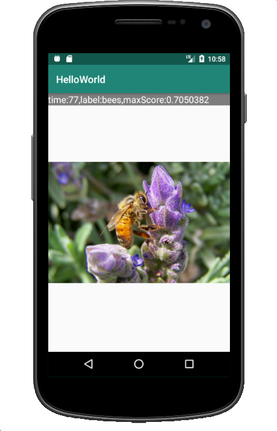

## Quickstart

[HelloWorld](https://github.com/pytorch/android-demo-app/tree/master/HelloWorldApp) is a simple image classification application that demonstrates how to use PyTorch Android API.
This application runs TorchScript serialized TorchVision pretrained [MobileNet v3 model](https://pytorch.org/vision/stable/models.html) on static image which is packaged inside the app as android asset.

#### 1. Model Preparation

Let’s start with model preparation. If you are familiar with PyTorch, you probably should already know how to train and save your model. In case you don’t, we are going to use a pre-trained image classification model(MobileNet v3), which is packaged in [TorchVision](https://pytorch.org/docs/stable/torchvision/index.html).
To install it, run the command below:
```
pip install torch torchvision
```

To serialize and optimize the model for Android, you can use the Python [script](https://github.com/pytorch/android-demo-app/blob/master/HelloWorldApp/trace_model.py) in the root folder of HelloWorld app:
```
import torch
import torchvision
from torch.utils.mobile_optimizer import optimize_for_mobile

model = torchvision.models.mobilenet_v3_small(pretrained=True)
model.eval()
example = torch.rand(1, 3, 224, 224)
traced_script_module = torch.jit.trace(model, example)
optimized_traced_model = optimize_for_mobile(traced_script_module)
optimized_traced_model._save_for_lite_interpreter("app/src/main/assets/model.ptl")
```
If everything works well, we should have our scripted and optimized model - `model.pt` generated in the assets folder of android application.
That will be packaged inside android application as `asset` and can be used on the device.

By using the new MobileNet v3 model instead of the old Resnet18 model, and by calling the `optimize_for_mobile` method on the traced model, the model inference time on a Pixel 3 gets decreased from over 230ms to about 40ms.

More details about TorchScript you can find in [tutorials on pytorch.org](https://pytorch.org/docs/stable/jit.html)

how to trace model to see python module code .

#### 2. Cloning from github
```
git clone https://github.com/1991wangliang/pytorch-classification.git
cd android
```
If [Android SDK](https://developer.android.com/studio/index.html#command-tools) and [Android NDK](https://developer.android.com/ndk/downloads) are already installed you can install this application to the connected android device or emulator with:
```
./gradlew installDebug
```

We recommend you to open this project in [Android Studio 3.5.1+](https://developer.android.com/studio) (At the moment PyTorch Android and demo applications use [android gradle plugin of version 3.5.0](https://developer.android.com/studio/releases/gradle-plugin#3-5-0), which is supported only by Android Studio version 3.5.1 and higher),
in that case you will be able to install Android NDK and Android SDK using Android Studio UI.

#### 3. Gradle dependencies

Pytorch android is added to the HelloWorld as [gradle dependencies](https://github.com/pytorch/android-demo-app/blob/master/HelloWorldApp/app/build.gradle#L28-L29) in build.gradle:

```
repositories {
    jcenter()
}

dependencies {
    implementation 'org.pytorch:pytorch_android_lite:1.9.0'
    implementation 'org.pytorch:pytorch_android_torchvision:1.9.0'
}
```
Where `org.pytorch:pytorch_android` is the main dependency with PyTorch Android API, including libtorch native library for all 4 android abis (armeabi-v7a, arm64-v8a, x86, x86_64).
Further in this doc you can find how to rebuild it only for specific list of android abis.

`org.pytorch:pytorch_android_torchvision` - additional library with utility functions for converting `android.media.Image` and `android.graphics.Bitmap` to tensors.

#### 4. Reading image from Android Asset

All the logic happens in [`org.pytorch.helloworld.MainActivity`](https://github.com/pytorch/android-demo-app/blob/master/HelloWorldApp/app/src/main/java/org/pytorch/helloworld/MainActivity.java#L31-L69).
As a first step we read `image.jpg` to `android.graphics.Bitmap` using the standard Android API.
```
Bitmap bitmap = BitmapFactory.decodeStream(getAssets().open("image.jpg"));
```

#### 5. Loading TorchScript Module
```
Module module = LiteModuleLoader.load(assetFilePath(this, "model.ptl"));
```
`org.pytorch.Module` represents `torch::jit::script::Module` that can be loaded with `load` method specifying file path to the serialized to file model.

#### 6. Preparing Input
```
Tensor inputTensor = TensorImageUtils.bitmapToFloat32Tensor(bitmap,
    TensorImageUtils.TORCHVISION_NORM_MEAN_RGB, TensorImageUtils.TORCHVISION_NORM_STD_RGB);
```
`org.pytorch.torchvision.TensorImageUtils` is part of `org.pytorch:pytorch_android_torchvision` library.
The `TensorImageUtils#bitmapToFloat32Tensor` method creates tensors in the [torchvision format](https://pytorch.org/docs/stable/torchvision/models.html) using `android.graphics.Bitmap` as a source.

> All pre-trained models expect input images normalized in the same way, i.e. mini-batches of 3-channel RGB images of shape (3 x H x W), where H and W are expected to be at least 224.
> The images have to be loaded in to a range of `[0, 1]` and then normalized using `mean = [0.485, 0.456, 0.406]` and `std = [0.229, 0.224, 0.225]`

`inputTensor`'s shape is `1x3xHxW`, where `H` and `W` are bitmap height and width appropriately.

#### 7. Run Inference

```
Tensor outputTensor = module.forward(IValue.from(inputTensor)).toTensor();
float[] scores = outputTensor.getDataAsFloatArray();
```

`org.pytorch.Module.forward` method runs loaded module's `forward` method and gets result as `org.pytorch.Tensor` outputTensor with shape `1x1000`.

#### 8. Processing results
Its content is retrieved using `org.pytorch.Tensor.getDataAsFloatArray()` method that returns java array of floats with scores for every image net class.

After that we just find index with maximum score and retrieve predicted class name from `ImageNetClasses.IMAGENET_CLASSES` array that contains all ImageNet classes.

```
float maxScore = -Float.MAX_VALUE;
int maxScoreIdx = -1;
for (int i = 0; i < scores.length; i++) {
  if (scores[i] > maxScore) {
    maxScore = scores[i];
    maxScoreIdx = i;
  }
}
String className = ImageNetClasses.IMAGENET_CLASSES[maxScoreIdx];
```

In the following sections you can find detailed explanations of PyTorch Android API, code walk through for a bigger [demo application](https://github.com/pytorch/android-demo-app/tree/master/PyTorchDemoApp),
implementation details of the API, how to customize and build it from source.


